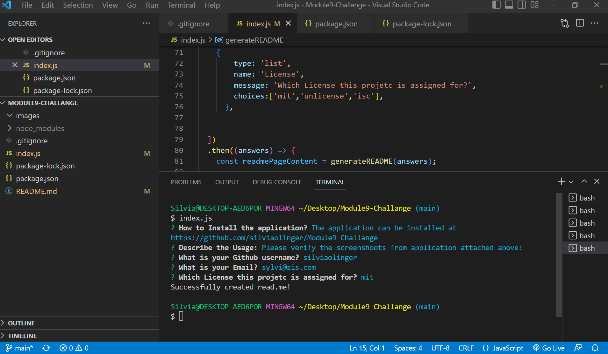
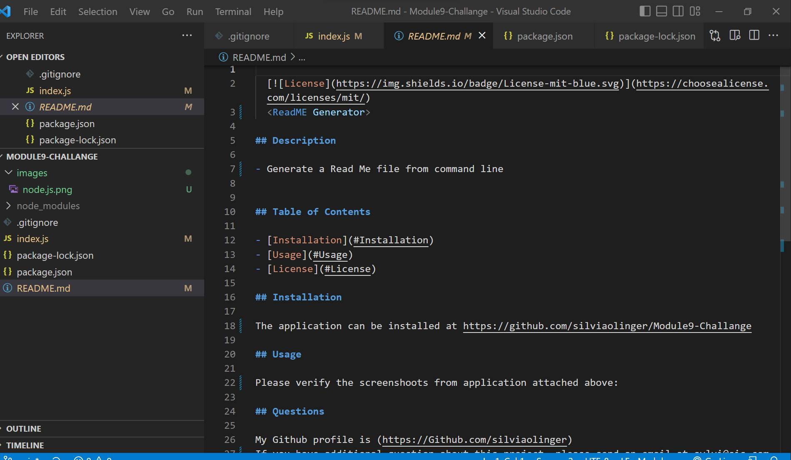
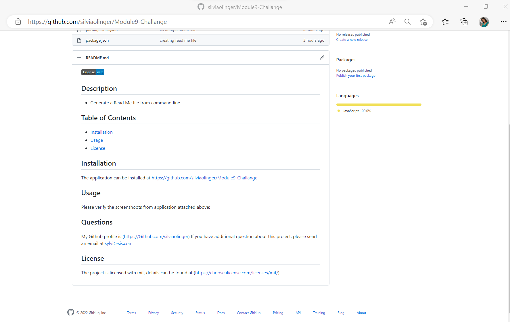

  
  <Read me Generator>

## Description

- Generate a readme file using command line.

## Table of Contents

- [Installation](#Installation)
- [Usage](#Usage)
- [License](#License)

## Installation

the application can be found at https://github.com/silviaolinger/Module9-Challange

## Usage

Please see the screenshoots attached:
***Prompt Inputs and Answers***

***Readme file generated***

***Readme file pushed to git repository***

## Questions

My Github profile is (https://Github.com/silviaolinger)
If you have additional question about this project, please send an email at sil@sil.com

## License
 The project is licensed with isc, details can be found at (https://choosealicense.com/licenses/isc/)

  